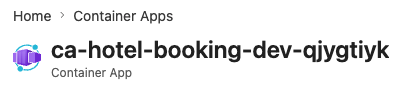
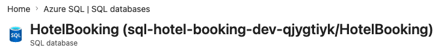

# Hotel Booking API

Backend developer challenge solution for a hotel room booking API.

The goal is to build a practical ASP.NET Core and EF Core REST API that can:

- Find a hotel by name.
- Find available rooms between two dates for a given number of guests.
- Book a room.
- Find booking details by booking reference.
- Seed predictable test data.
- Reset all data for testing.

The solution intentionally stays small and reviewer-friendly. It is not a hotel
management platform.

Deployed API:
[Azure Swagger UI](https://ca-hotel-booking-dev-qjygtiyk.agreeableriver-d928ad99.uksouth.azurecontainerapps.io/swagger)

## Project Structure

```text
HotelBooking.slnx
src/
  HotelBooking.Api/
  HotelBooking.Models/
  HotelBooking.Repository/
  HotelBooking.Services/
tests/
  HotelBooking.UnitTests/
  HotelBooking.IntegrationTests/
infra/
  bicep/
  local/
docs/
```

## Requirements

- .NET SDK 10
- Docker Desktop
- Azure CLI with Bicep support, optional
- GitHub CLI for repository/PR work, optional

## Build And Test

Docker must be running because integration tests start a disposable SQL Server
container and apply the real EF Core migrations.

```bash
dotnet tool restore
dotnet restore HotelBooking.slnx
dotnet build HotelBooking.slnx --no-restore -m:1 --disable-build-servers
dotnet test HotelBooking.slnx --no-restore --no-build -m:1 --disable-build-servers
```

Run the dependency audit:

```bash
dotnet list HotelBooking.slnx package --vulnerable --include-transitive
```

## Run Locally

The local API uses SQL Server from Docker Compose. The development connection
string expects the same password as `.env.example`.

1. Create `.env`:

```bash
cp .env.example .env
```

2. Start SQL Server:

```bash
docker compose --env-file .env -f infra/local/compose.yaml up -d sql
```

3. Run the API:

```bash
dotnet run --project src/HotelBooking.Api
```

Alternatively, build and run both the API container and SQL Server:

```bash
docker compose --env-file .env -f infra/local/compose.yaml up --build -d
```

This containerized path uses `sql` as the database hostname and exercises the
same API `Dockerfile` used by GHCR and Azure Container Apps.

4. Open Swagger:

```text
http://localhost:5000/swagger
https://localhost:5001/swagger
```

Use the HTTP URL if the local HTTPS development certificate is not trusted.
The containerized API exposes only `http://localhost:5080/swagger`.

The API also exposes:

```text
GET /health
GET /openapi/v1.json
GET /swagger/v1/swagger.json
```

## Local SQL Server

Local development uses SQL Server in Docker Compose so local EF Core behavior is
close to Azure SQL Database.

Schema changes are managed through EF Core migrations. Seed/reset applies any
pending migrations before changing test data.

Create a migration after changing the EF model:

```bash
ASPNETCORE_ENVIRONMENT=Development dotnet ef migrations add <MigrationName> \
  --project src/HotelBooking.Repository/HotelBooking.Repository.csproj \
  --startup-project src/HotelBooking.Api/HotelBooking.Api.csproj \
  --output-dir Data/Migrations
```

Existing local databases created before `InitialCreate` have no migration
history. Recreate the disposable local volume once before running the
migration-enabled version:

```bash
docker compose --env-file .env -f infra/local/compose.yaml down -v
docker compose --env-file .env -f infra/local/compose.yaml up -d sql
```

Validate the Compose file:

```bash
docker compose --env-file .env.example -f infra/local/compose.yaml config --quiet
```

Stop local SQL Server while preserving the database volume:

```bash
docker compose --env-file .env -f infra/local/compose.yaml down
```

Default local connection-string shape:

```text
Server=localhost,1433;Database=HotelBooking;User Id=sa;Password=<MSSQL_SA_PASSWORD>;Encrypt=True;TrustServerCertificate=True
```

If you change `MSSQL_SA_PASSWORD` after SQL Server has already created its
Docker volume, recreate the local SQL Server volume or change the password back
to the original value.

## API Endpoints

Implemented endpoints:

```text
GET  /api/hotels?name=...
GET  /api/hotels/{hotelId}/rooms/available?checkIn=...&checkOut=...&guests=...
POST /api/bookings
GET  /api/bookings/{reference}
POST /api/admin/seed
POST /api/admin/reset
GET  /health
```

The seeded hotel ID is fixed so reviewer tests are predictable:

```text
00000000-0000-0000-0000-000000000001
```

Seeded rooms:

```text
101 Single capacity 1
102 Single capacity 1
201 Double capacity 2
202 Double capacity 2
301 Deluxe capacity 4
302 Deluxe capacity 4
```

## Manual API Test Flow

These examples use HTTP to avoid local certificate warnings:

```bash
BASE_URL=http://localhost:5000
HOTEL_ID=00000000-0000-0000-0000-000000000001
```

Reset and seed predictable data:

```bash
curl -i -X POST "$BASE_URL/api/admin/reset"
curl -i -X POST "$BASE_URL/api/admin/seed"
```

Find the seeded hotel by name:

```bash
curl "$BASE_URL/api/hotels?name=Grand"
```

Find available rooms:

```bash
curl "$BASE_URL/api/hotels/$HOTEL_ID/rooms/available?checkIn=2026-08-01&checkOut=2026-08-03&guests=2"
```

Filter availability by room type:

```bash
curl "$BASE_URL/api/hotels/$HOTEL_ID/rooms/available?checkIn=2026-08-01&checkOut=2026-08-03&guests=2&roomType=Double"
```

Book a room:

```bash
curl -i -X POST "$BASE_URL/api/bookings" \
  -H "Content-Type: application/json" \
  -d '{
    "hotelId": "00000000-0000-0000-0000-000000000001",
    "guestName": "Ada Lovelace",
    "guestCount": 2,
    "checkInDate": "2026-08-01",
    "checkOutDate": "2026-08-03",
    "roomType": "Double"
  }'
```

Look up the booking by the returned `bookingReference`:

```bash
curl "$BASE_URL/api/bookings/HB-123456"
```

Dates use `yyyy-MM-dd` format. A booking uses a half-open date range:
`[checkInDate, checkOutDate)`, so a room can be booked again on the checkout
date. Check-in must be later than the current UTC date.

## Design Notes

- `ProblemDetails` is used for invalid API requests because it is the ASP.NET
  Core standard error response shape.
- No authentication is included because the challenge does not require it.
- Seed/reset endpoints are intentionally available because the challenge asks
  for test data setup.
- The booking service checks availability inside a serializable transaction.
  SQL Server retries transient concurrency failures, and integration tests
  verify concurrent requests cannot double book the final room.

## Documentation

- [Challenge Brief](challenge.md)
- [Challenge Solution Summary](docs/hotel-booking-challenge-solution.md)
- [Booking Concurrency](docs/booking-concurrency.md)
- [Implementation Plan](docs/plan.md)
- [Solve Challenge Guide](docs/solve-challenge-guide.md)
- [Azure Bicep Guide](docs/Azure-bicep-guide.md)
- [Azure Deployment Runbook](docs/Azure-deployment.md)

## Deployed Azure Resources

The main environment is deployed in `rg-hotel-booking-dev-uk-south`.

### Container App

`ca-hotel-booking-dev-qjygtiyk` hosts the public ASP.NET Core API:



### Azure SQL Database

The cost-optimized deployment uses the `HotelBookingFree` free-offer database
on the serverless SQL server
`sql-hotel-booking-dev-qjygtiyk`:



## Optional Azure Deployment

The optional hosted shape is:

```text
Public GHCR image -> Azure Container Apps Consumption -> Azure SQL serverless
```

There is no Application Insights or Log Analytics workspace. Container Apps
has no application-log destination configured, avoiding log-ingestion charges.

The `Publish API image` workflow runs after API-related changes reach `main`.
It publishes only the immutable commit SHA tag:

```text
ghcr.io/sses79/hotel-booking-api:<commit-sha>
```

After its first run, make the GHCR package public in the package settings. The
Container App can then pull it anonymously without Azure Container Registry or
stored GHCR credentials.

Create a resource group and choose the image SHA:

```bash
az group create \
  --name rg-hotel-booking-dev-uk-south \
  --location uksouth

export API_IMAGE_TAG='<commit-sha>'
export AZURE_SQL_ADMIN_PASSWORD='<strong-unique-password>'
```

Both values are read from the environment, so neither is stored in the
committed parameter file. Bicep treats the SQL password as a secure parameter.

Validate and preview before deploying:

```bash
az bicep build --file infra/bicep/main.bicep

az deployment group what-if \
  --resource-group rg-hotel-booking-dev-uk-south \
  --template-file infra/bicep/main.bicep \
  --parameters infra/bicep/environments/dev.bicepparam

az deployment group validate \
  --resource-group rg-hotel-booking-dev-uk-south \
  --template-file infra/bicep/main.bicep \
  --parameters infra/bicep/environments/dev.bicepparam

az deployment group create \
  --resource-group rg-hotel-booking-dev-uk-south \
  --template-file infra/bicep/main.bicep \
  --parameters infra/bicep/environments/dev.bicepparam \
  --output table
```

Use the `apiUrl` deployment output to open `/health` and `/swagger`, then call
`POST /api/admin/seed` before testing the business endpoints. Azure SQL starts
empty, and the seed operation creates the EF Core schema and predictable demo
data.

## CI

GitHub Actions runs:

- restore, build, and test
- EF Core migration drift validation
- Bicep compilation
- whitespace check
- Docker Compose config validation
- NuGet vulnerable dependency audit

CI validation is read-only and does not deploy to Azure. The separate image
workflow writes only to GHCR; Azure deployment remains an explicit manual step.
