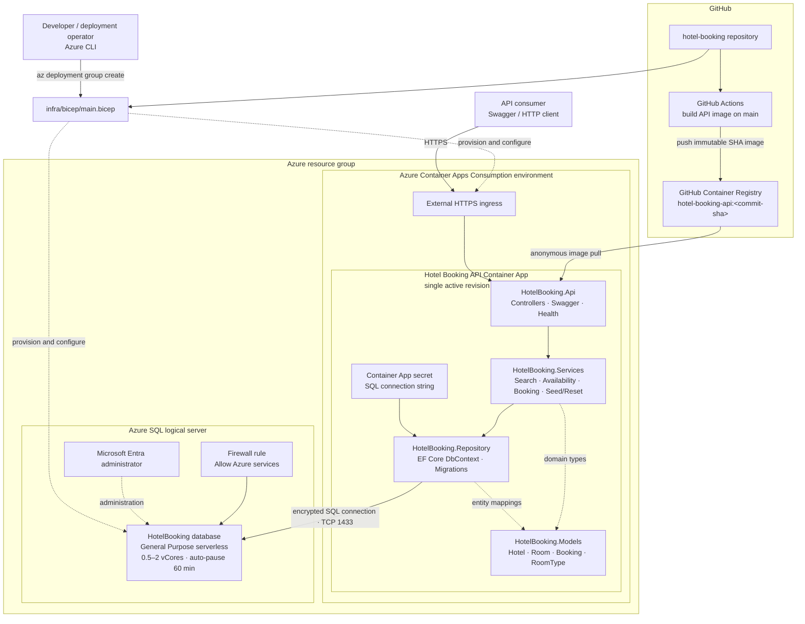

# Azure Infrastructure Architecture

This diagram shows the source-to-deployment flow and the Azure resources
provisioned for the hosted API.

GitHub Actions publishes an immutable commit-SHA image to GHCR. Bicep
provisions the Container Apps environment, externally accessible API, SQL
logical server, firewall rule, Entra administrator, and serverless database.
