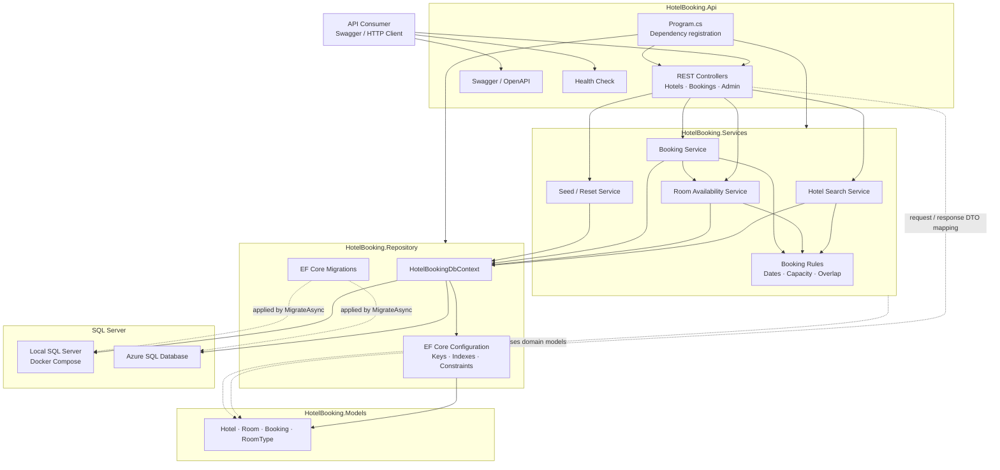

# Solution Architecture

This diagram shows the runtime flow through the current solution projects and
the local and Azure database targets.

The API project is the HTTP entry point, Services owns the booking use cases,
Repository configures EF Core and SQL Server persistence, and Models contains
the shared data model.
